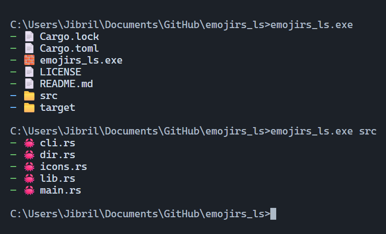

# emojirs_ls

**emojirs_ls** is an alternative to `ls`, written in Rust, fast and minimalist. It displays files in a clear and intuitive way, using emojis to make terminal navigation more visual and enjoyable.